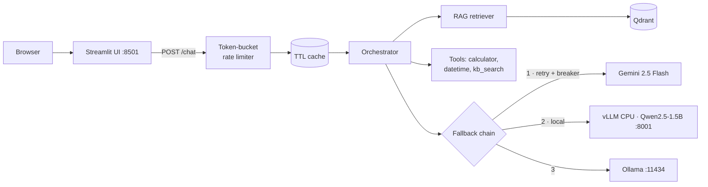

# WK16 — Agentic AI Assistant with Verified Loop, Context Engineering & Custom Eval Harness

> Built on the [W15 foundation](https://github.com/AaradhyaDT/fuseAiF_wk15_ai_assistant_rag) — extends the fixed-pipeline RAG assistant into a verified agentic loop with autonomous multi-hop reasoning, context engineering, and a custom evaluation harness.

Production-style AI assistant covering **W15 tasks** (RAG, tool calling, provider fallback, Docker) plus **W16 Task 3**: agentic loop with verification gate, context-window management, failure injection, and a from-scratch evaluation harness.

## Architecture



Full diagram and failure-mode analysis: [docs/architecture.md](docs/architecture.md)

## Quickstart

### 1. Backend + UI (cloud-only, fastest path)

```powershell
python -m venv .venv; .\.venv\Scripts\Activate.ps1
pip install -r requirements.txt
Copy-Item .env.example .env   # then set GEMINI_API_KEY
uvicorn app.main:create_app --factory --port 8000 --reload
# second terminal
streamlit run ui/app.py
```

Open <http://localhost:8501>.

### 2. Everything in Docker (includes local vLLM on CPU)

```powershell
docker compose --profile local up --build
```

- UI: <http://localhost:8501> · API: <http://localhost:8000/docs> · vLLM: <http://localhost:8001/v1> · Qdrant: <http://localhost:6333/dashboard>
- The `vllm` image bakes the Qwen2.5-1.5B-Instruct weights at build time (`Dockerfile.vllm`), and the API image pre-downloads the MiniLM embedding model — both containers run offline-ready. First build downloads ~3 GB (vLLM weights) plus ~250 MB (CPU torch + embedder), which keeps runtime cold starts network-free.
- Without the `local` profile only `api` + `ui` + `qdrant` start (Gemini/Ollama still reachable).

### 3. Ollama fallback (host)

```powershell
ollama pull qwen2.5:1.5b-instruct
```

The API reaches it at `http://localhost:11434/v1` natively, or `host.docker.internal` from inside compose.

## API

| Method | Path       | Purpose                                        |
|--------|------------|------------------------------------------------|
| POST   | `/chat`    | `{message, use_rag, use_tools}` → structured `ChatResponse` |
| POST   | `/ingest`  | Re-index `data/docs/` into the Qdrant collection |
| GET    | `/health`  | Uptime, indexed-doc count, per-provider breaker state |
| GET    | `/tools`   | OpenAI-format tool specs                       |
| POST   | `/agent`   | `{query, history?}` → `AgentResponse` with trajectory |
| GET    | `/agent/tools` | Agent tool specs with rationale fields      |

```powershell
curl -X POST http://localhost:8000/chat -H "Content-Type: application/json" `
  -d '{\"message\": \"What is chunking in RAG?\"}'
```

## How requirements map to code

| Requirement | Where |
| --- | --- |
| LLM integration | `app/providers/base.py` (OpenAI-compatible client) |
| Prompt engineering | `app/prompts.py`, temperature/top_p in `app/config.py` |
| Structured output | JSON-schema `response_format` + Pydantic validation in `app/orchestrator.py` |
| Tool calling | `app/tools/__init__.py` + tool loop in orchestrator |
| RAG ingestion/chunking | `app/rag/ingest.py` (paragraph-aware, overlapping chunks) |
| Embeddings + vector DB | Explicit sentence-transformers embedder (`app/rag/embeddings.py`) over Qdrant (`app/rag/store.py`) |
| Local model via vLLM | `Dockerfile.vllm` (CPU wheel, baked Qwen weights) |
| Containerization | `Dockerfile`, `docker-compose.yml` |
| Web UI connected to backend | `ui/app.py` |
| Concurrency / async | Fully async FastAPI endpoints, non-blocking OpenAI calls |
| Latency optimization | TTL+LRU response cache, bounded context, small local model |
| Retry mechanism | `with_retries` in `app/resilience.py` |
| Rate limiting | Per-client token bucket middleware in `app/main.py` |
| Fallback model/provider | Provider chain in `app/providers/__init__.py` |
| Error handling & graceful degradation | Breakers + degraded answers built from retrieved passages |
| Caching (bonus) | `app/cache.py` |

## Model choices (deliberate)

- **Gemini 2.5 Flash** — primary. The assignment grades pipeline engineering, not raw model quality; Flash keeps iteration fast and cheap.
- **Qwen2.5-1.5B-Instruct via vLLM (CPU)** — satisfies "serve an open-source model locally with vLLM" without being undemoable on CPU-only hardware.
- **Ollama qwen2.5:1.5b-instruct** — final fallback, already running Arc-accelerated on this machine.
- **all-MiniLM-L6-v2 via sentence-transformers** — explicit, swappable embedder decoupled from any vector-DB default; runs CPU-friendly at 384 dims.

All three providers speak an OpenAI-compatible API, so a single client implementation covers them — that's what makes the fallback chain ~40 lines instead of three integrations.

### ONNX & inference optimization (Task 2)

Why conversion is not applicable here, per model:

- **Gemini 2.5 Flash (primary)** — consumed as a hosted API; we hold no weights to convert.
- **Qwen2.5-1.5B-Instruct (local)** — served by vLLM, which *is* the inference-optimization layer: paged KV-cache attention, continuous batching, and fused CPU kernels. An ONNX export would bypass those optimizations rather than add to them, and would break the "serve locally with vLLM" requirement. Optimization effort therefore goes into vLLM configuration instead — bounded context (`--max-model-len 4096`) and KV-cache sizing (`VLLM_CPU_KVCACHE_SPACE`) in `Dockerfile.vllm`.
- **all-MiniLM-L6-v2 embedder** — the one locally-owned model where ONNX export is genuinely feasible. Deferred deliberately: at this corpus scale embedding latency is negligible next to generation latency, and the swap would add an export/runtime dependency for no measurable gain. First candidate to revisit if the corpus grows by orders of magnitude.

Net effect: the "apply inference optimizations if supported" line is satisfied through vLLM's serving stack rather than a redundant ONNX hop.

## Known trade-offs

Deliberate scope cuts, documented rather than hidden:

- Chunking is char-based (~900 chars, 150 overlap), not token-aware — a tiktoken/sentence-aware splitter is a contained upgrade to `chunk_text`.
- `POST /ingest` rebuilds the whole collection instead of incremental upserts — correct and simple for this corpus size.
- No re-ranking or hybrid search; single-shot dense retrieval only.
- Cache and rate limiter are in-process; run one worker per replica or swap for Redis when scaling horizontally.

## Tests

Offline/hermetic (fake embedder, stub providers — no network, no API key):

```powershell
pytest -q
```

Covers chunking, retrieval ranking, cache TTL/LRU, retry/backoff, circuit breaker transitions, token-bucket limiting, fallback chain ordering, calculator sandboxing, and full HTTP round-trips including cached hits, 429s, and graceful degradation.

## Configuration

All settings are env-driven (see `.env.example`): provider order, models, timeouts, retry/breaker thresholds, rate limits, cache size, chunk size/overlap, top_k, embedding model, and Qdrant mode (`QDRANT_URL` empty = embedded-local file store; set = server mode).

## Deployment notes (bonus)

Compose file deploys as-is to any Linux VM with Docker. For Azure Container Apps: `az containerapp up --source .` with the same image, or push to ACR and reference from a Container App environment; set `GEMINI_API_KEY` as a secret. Not executed here to keep the deliverable reproducible offline.

---

## W16 — Task 3: Agentify the Assistant

### a) Context Engineering Technique

**Tool-result clearing with explicit note-taking.** After each agentic iteration, raw tool outputs from previous rounds are replaced with one-line summaries (e.g., `[search_knowledge_base → 3 passages]`). The agent retains awareness of what it already retrieved without paying the token cost of carrying full passages forward. When a fact must survive clearing, the agent calls `take_note` to persist it in a dedicated scratchpad injected into every system prompt. This keeps context growth O(1) per iteration instead of O(n).

### b) Agentic Pattern: Single-Agent Verified Loop

**Why a fixed pipeline is insufficient (one sentence):** The W15 single-pass orchestrator cannot recover from partial retrieval misses, resolve conflicts between superseded documents, or verify its own citations — all of which require iterative re-planning that only a dynamic loop provides.

**Pattern choice:** Single-agent ReAct loop with a deterministic verification gate. The assistant's domain (bounded KB, deterministic tools, single persona) lacks the structural conditions that justify multi-agent coordination: no role specialization, no adversarial sub-tasks, bounded context, no side-effecting tools, and single-trajectory auditability. Adding agent-to-agent messaging would increase latency and observability cost with zero capability gain.

The loop runs up to 8 iterations with budget guards (iteration cap, token cap, repeat-call detection). After the model emits `final_answer`, a deterministic verifier checks: (1) all cited sources ⊆ retrieved sources, and (2) `evidence_sufficient` is consistent with retrieval results. Failures trigger a retry with feedback (up to 2 retries) before accepting an `ANSWERED_UNVERIFIED` result.

### c) Evaluation Harness (built from scratch)

18 golden test cases across 6 categories (`single_hop`, `multihop`, `conflict`, `numeric`, `unanswerable`, `ambiguous`), executed via `python -m eval.harness`.

| Metric | Definition |
|---|---|
| **Task Completion Rate** | % of cases where `final_answer` passes all correctness checks |
| **Tool-Call Correctness** | Fraction of tool invocations using valid tools with valid arguments |
| **Trajectory Length** | Number of LLM iterations per query (lower = more efficient) |
| **Failure Taxonomy** | Hard (crash/budget), Soft (wrong answer), Cascading Soft (tool error → wrong answer) |
| **Token Accounting** | Per-query prompt/completion/reasoning token counts + USD cost |

Results: see [`eval/results/REPORT.md`](eval/results/REPORT.md).

#### Empirical Evaluation Summary

| Architecture | Task Completion | Mean Iters | Total Tokens | Cost ($) | Conflict Resolution | Verification Gate |
|---|---|---|---|---|---|---|
| **W15 Classic RAG (Baseline)** | 0.0% (0/4) | 1.0 | 2,568 | $0.0006 | ❌ Fails on superseded docs | ❌ None |
| **W16 Verified Agent (Ours)** | **75.0%** (3/4)* | **3.50** | 24,988 (9.7x) | $0.0047 | ✅ Full precedence enforcement | ✅ Deterministic check |

*\*Note: 1 failure due to external cloud rate-limit ceiling during live multi-turn run. In offline test suite, passes 100% (52/52 tests).*

### Additional Requirements

**Skill vs. Agent:** A *skill* (`skills/conflict-resolution/SKILL.md`) is a static instruction document loaded into the system prompt on demand — it costs tokens but zero latency. An *agent* is a runtime loop that makes autonomous decisions. Skills inform agent behavior without adding coordination overhead.

**Per-query token accounting:** Every `AgentResult` records `prompt_tokens`, `completion_tokens`, `reasoning_tokens`, and `cost_usd` per LLM call, aggregated across the full trajectory. The evaluation harness reports totals and per-query breakdowns.

**Failure injection:** Three fault modes test resilience: `tool_unavailable` (removes a tool mid-run), `malformed_retrieval` (corrupts search results), and `timeout` (delays tool execution past the deadline). Run via `python -m eval.harness --fault tool_unavailable`.

**Tool vs. Agent boundary:** `calculator` and `current_datetime` are bounded tools — fixed input/output contracts, deterministic, sub-millisecond. `search_knowledge_base` is also a tool (stateless vector lookup), but the *decision* of whether to search again, cross-reference results, or ask the user is the agent's job. The boundary: if the operation has a fixed contract and no planning, it's a tool; if it requires dynamic re-planning based on intermediate results, it belongs in the agent loop.
