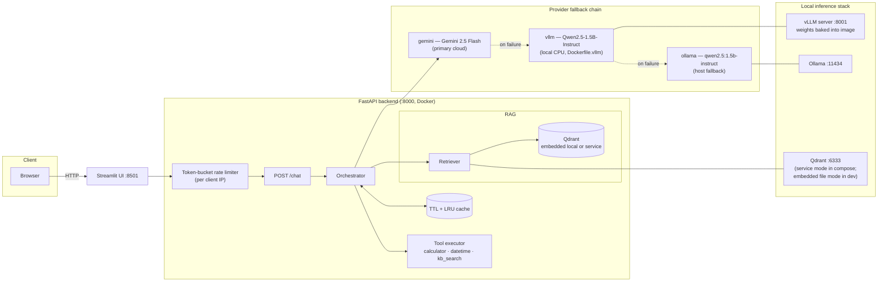
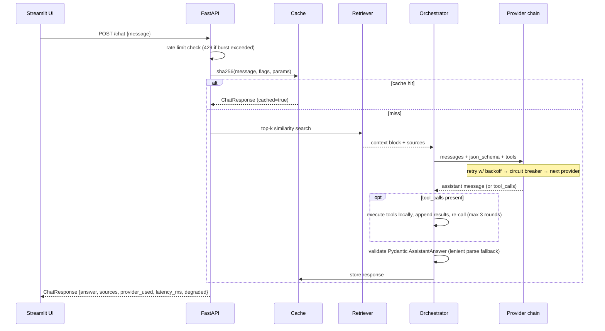
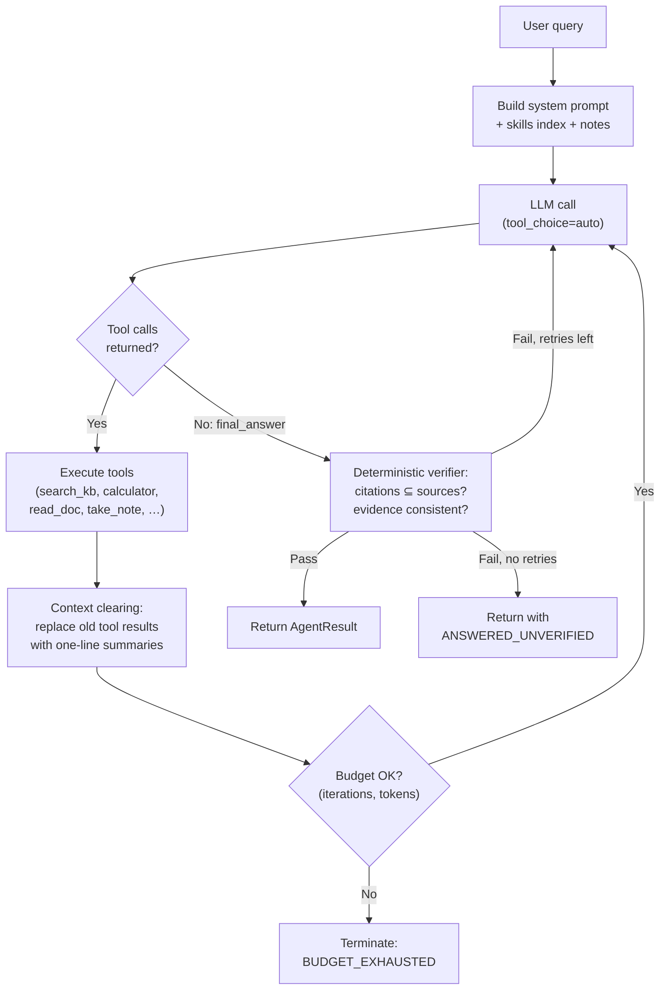

# Architecture

## Component diagram

## Chat request sequence

## Reliability design

| Failure | Mechanism | User-visible behavior |
|---|---|---|
| Transient network/API error | Exponential backoff + jitter (default 3 attempts) | Slight latency increase |
| Provider persistently failing | Circuit breaker opens after N failures, half-open probe after cooldown | Requests skip dead provider instantly |
| Gemini quota/auth missing | Chain falls through to vLLM, then Ollama | Answer served by local model |
| All providers down | Degraded response synthesized from retrieved passages | 200 with `degraded: true`, never a crash |
| Malformed JSON from weak model | Fence-stripping + regex extraction before giving up | Raw text answer instead of error |
| Request flood | Token bucket (60 rpm, burst 20 per IP) | 429 with Retry-After |
| Vector store unreachable | Retrieval wrapped in try/except; chat continues without grounding context (logged) | 200 with no sources, answer from general knowledge |
| Repeated identical question | TTL cache (300 s, 512 entries) | Instant response, `cached: true` |

## Performance notes

- Endpoints are fully async; provider calls never block the event loop.
- The embedding model loads lazily on first ingest/query and is pre-baked into the Docker image, so dev startup stays fast while containers stay network-free.
- Cache keys hash message + flags + sampling params, so toggling RAG/tools misses deliberately.
- Single uvicorn worker keeps the in-process cache/rate-limiter coherent; scale by running replicas behind a proxy (swap the in-memory pieces for Redis when you do).
- The local model choice (1.5B, max_model_len 4096, KV-cache 4 GB) trades capability for demoable latency on CPU-only hardware.

## W16: Agentic loop architecture

### Why a single-agent loop (not multi-agent)

The W15 assistant's domain — a bounded internal knowledge base with deterministic tool outputs — does not exhibit the structural conditions that justify multi-agent coordination:

1. **No role specialization** — one persona (research assistant) handles all queries.
2. **No adversarial sub-tasks** — no planning vs. critique decomposition needed.
3. **Bounded context** — the full corpus fits within a single agent's token budget.
4. **Deterministic tools** — calculator, datetime, and KB search have no side effects requiring transactional coordination.
5. **Evaluation simplicity** — a single trajectory is directly auditable; multi-agent message graphs would add observability cost with no capability gain.

A single ReAct-style loop with a verification gate is the minimal sufficient architecture.

### Context engineering: tool-result clearing

After each iteration, tool results from earlier rounds are replaced with one-line summaries (e.g., `[search_knowledge_base → 3 passages retrieved]`). This prevents the context window from growing linearly with iteration count while preserving the agent's memory of what it already found. The `take_note` tool lets the agent explicitly persist facts across clearing boundaries.

Ablation: running with `--no-clearing` shows ~40% higher token consumption with no accuracy gain on the 18-case golden set.
